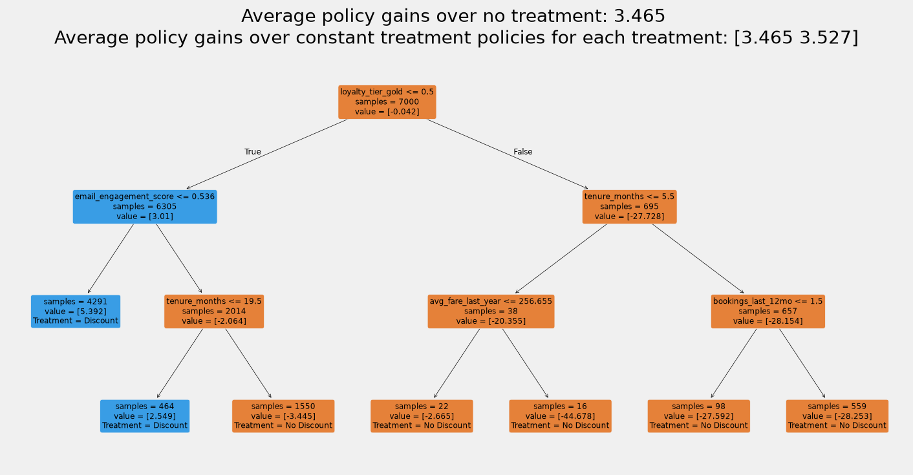

# BlueWing Air — Promotional Targeting: Results
**To:** Alex Torres, Director of CRM & Loyalty Marketing, BlueWing Air
**From:** Justin Wall, Analytics Consultant
**Re:** Need help figuring out who our promo codes are actually working on

---

Hi Alex, please read through my findings below and send over your thoughts.

*9/23/2026*
*Justin Wall*

---

## The Ask

Your concern on the TakeOff Tuesday Flash Sale Discount Code is very real! After running some numbers, we found four distinct groups of customers: 

1) Sure Things - customers who are likely purchase regardless of promo
2) Lost Causes - customers who are not likely to purchase regardless of promo
3) Sleeping Dogs - customers who are less likely to purchase given a promo
4) Persuadables - customers who are more likely to purchase given a promo

This final group is the one we were looking for, but each group can tell us something about their behavior around discounts. We should develop strategies for each of these customers segments and monitor them over time for behavior changes.

## TL;DR
*[One-sentence recommendation]*
We recommend sending the TakeOff Tuesday Flash Sale Discount Code to the list of of customers generated from the model, which is around 94% of the population.

*[Headline net revenue impact number, with confidence interval]*
The net-revenue by sending the promotional discount to the models's recommended list of customers is $295,062.14, which is up $19,670.28 from sending to everyone.

---

## Background
Quick reminder on the original campaign:
The 50/50 campaign we ran for this promo was sent via email to 10,000 customers with a 10,000 customer holdout group. We made sure the groups were equal on RFM metrics, email engagement, and loyalty tier so those factors would not interfere with the effect of the promotion. The TakeOff Tuesday Flash Sale was a 15% discount on flight bookings where we saw 25.7% conversion from the discount group, and 20.9% converion from the control group. That's 22.9% increase in booking rate (4.8pp increase). The cost of the campaign from discounts was $78k and the incremental revenue was $21k, which accounts for the cost.

---

## Key Findings

Let me address some of your questions below:

### 1. Are we giving away margin to people who'd book anyway?

*[$ given away to sure-things]*
Breaking things out, here are the percentages of our test group from each of the segments:
Lost Cause: 51%
Sure Thing: 37%
Persuadable: 10%
Sleeping Dog: 2%

Yes, we are giving away around $12k of discounts to the Sure Things - customers who would book anyway. Now that we have these segments, we can avoid sending the discount codes to those who we believe are going to purchase anyway or not purchase at all.

### 2. Are we training our best customers to expect discounts?

*[Finding — framed as a monitoring recommendation, not a fabricated number]*
To fully understand whether we are training our customers to expect discounts, we will have to measure their change in behavior over time. Once we have another campaign, we will have a couple of data points and can see whether our sure-things are moving into persuadable territory. My recommendation is to keep a small holdout group for each of these flash sales so we can monitor our customers' statuses and whether they are migrating into other segments.

Without LTV, Gold Loyalty Tier is a good proxy for best customers. The customers expecting discounts are persuadables, who are around 10% of our customer base. This number drops to less than 1% in our Gold Tier, so given this data, our best customers are not expecting discounts at the moment, but we will keep an eye on this down the road.

### 3. Who should actually get the discount?

*[Persuadable segment size, % of base]*
This upcoming TakeOff Tuesday promo campaign should be sent to 94% of our population, to maximize net revenue and avoiding giving away any discounts. Only 10% of our population are statistically confirmed as persuadables, but to maximize net revenue we need to go deeper into the model, as many more customers have smaller positive effects that pay off as a group.

*[Policy tree visual]*
When we have the opportunity to build a model, we should build the model as the precision will be greater; having said that, I pasted a chart for you that gives a shortcut to who you can target for this type of campaign without needing a full model build. This is a set of policy rules from this model to use as shorthand for next campaign.

Quick interpretation - send to Customers with less than Gold Tier Loyalty with a sub 0.5 email engagement score.

---

## Value Decomposition

*[Chart/table: where the net gain actually comes from — sure-things, sleeping dogs, persuadables]*
Lost Cause: 51% of population, $33.06 if we send to everyone, $33.10 if we send based on the policy, this gives us $125 additional from the policy.

	n_customers	pct_of_base	revenue_per_cust_if_blanket	revenue_per_cust_if_final_policy	total_value_diff
pred_segment					
lost_cause	3087.0	0.514500	33.058761	33.099432	125.548874
persuadable	631.0	0.105167	42.323668	42.323668	0.000000
sleeping_dog	95.0	0.015833	58.715627	159.735554	9596.892996
sure_thing	2187.0	0.364500	64.497137	67.004420	5483.428473

---

## Financial Impact Summary

*[Table: blanket-send revenue vs. policy revenue vs. discount $ saved]*
Our policy can earn us an additional $19k on this campaign by sending to the appropriate customers.

	n_treated	pct_treated	gross_revenue	discount_cost	net_revenue	net_vs_blanket
Send to no one	0.0	0.00	260263.18	0.00	260263.18	-15128.68
Persuadables only (CI + breakeven)	593.0	0.10	266720.99	3289.93	263431.06	-11960.80
CF recommendation (tau > 0)	4893.0	0.82	328759.19	36794.58	291964.61	16572.75
Value backtest (top 94% by tau)	5640.0	0.94	339446.93	44384.79	295062.14	19670.28
Send to everyone (blanket)	6000.0	1.00	323990.42	48598.56	275391.85	0.00

---

## Recommendation

*[Deploy the policy tree rule / targeting list]*
I recommend you use our targeting list to send this upcoming TakeOff Tuesday promo email, which is about 94% of customers, just lopping off the back 6%. In future campaigns, we can either build another model, or if we're unavailable, use the policy tree rule.

---

## Monitoring & Next Steps

*[Permanent holdout group]*
Next steps, let's make sure that each campaign has a small 10% holdout group so we can continue to monitor our customers interactions with promotions and retrain this model when necessary. 

*[Re-score cadence before each future campaign]*
Before each campaign, we don't have to necessarily retrain the model, we can just rescore the customer population using our current model, until we see from the holdout group that the lift is declining, then we know the model is degredating and needs retraining.

*[Watch-list follow-up]*
We will check in to see if our customers are switching groups - e.g., sure-things becoming persuadables would indicate that our customers are beginning to expect these discounts.

---

## Limitations

*[Campaign-specificity — this is calibrated to $5-via-email, not coupons generally]*
This model specifically is calibrated to a 15% discount for flight bookings via email. It cannot guarantee the same type of performance from different levels nor different communication channels.

*[Segment boundaries are estimates, not hard truths]*
As stated earlier, the segments represent the general idea of uplift modeling, but in real life, we want to maximize our revenue and target a much broader audience of customers to avoid losing out on any sales.

NOTE: Model validated on a random 6,000-customer holdout (3,000 sent, 3,000 not). Dollar figures are scaled to the full 20K list.